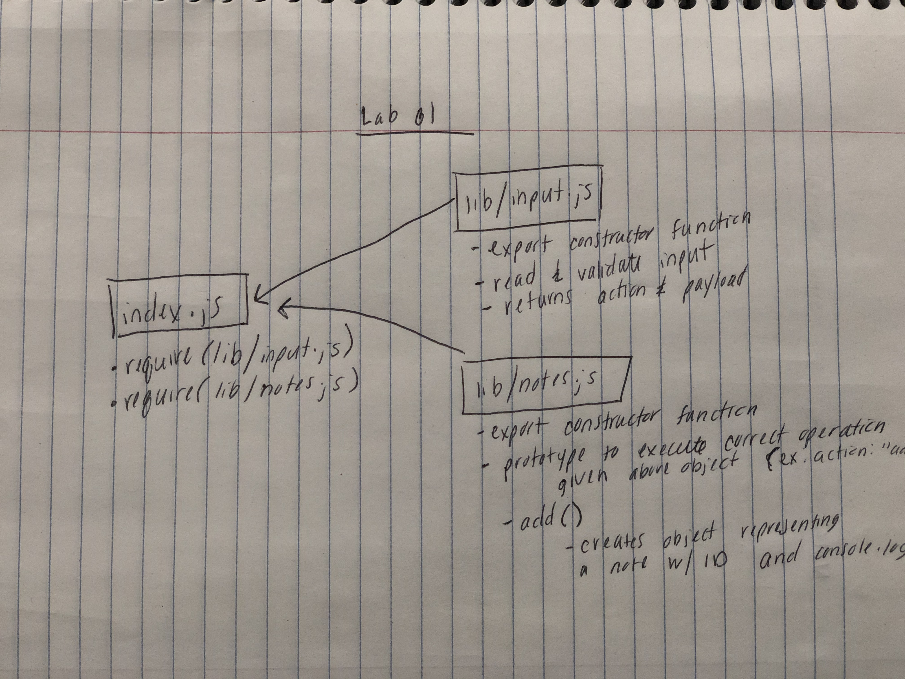
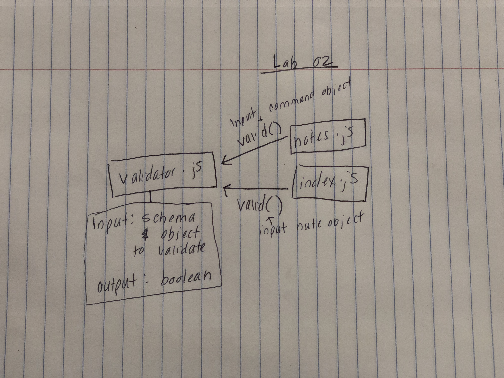
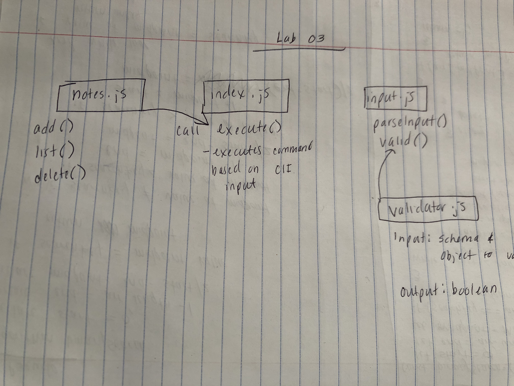
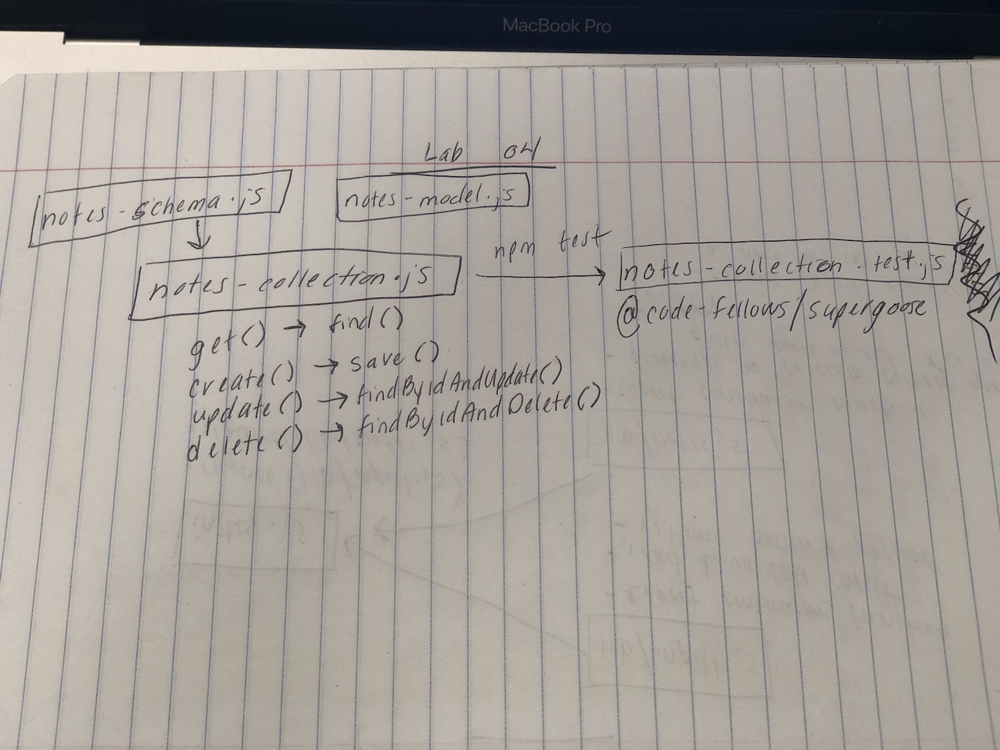

## Notesy Application

### Author: Susanna Lakey

#### Installation:
`npm install -g @slakey/notesy`

#### How to use the Notesy app
* From the command line, use the following commands:
  - Category: -c or --comannd
  - To Add a new entry: -a or --add (ex: notesy -a "mango" -c fruit)
  - To delete an entry: -d or --delete (notesy -d "id-of-entry-here")
  - To list all entries: -l or --list (notesy -l)
  - To list an entry by category: notesy (notesy --list "fruit")

#### How to initialize/run your server app (where applicable)
* `npm install minimist mongoose mongo`

#### To run the server:
* `mongod --dbpath=db`

  
#### Tests
* Unit Tests: 'npm test'
* Lint Tests: 'npm run lint'

#### UML

### Links and Resources
* [submission PR](https://github.com/susannalakey-401-advanced-javascript/notes/pull/1)
* Help from husband, Ben Lakey, on how to organize tests when writing them.