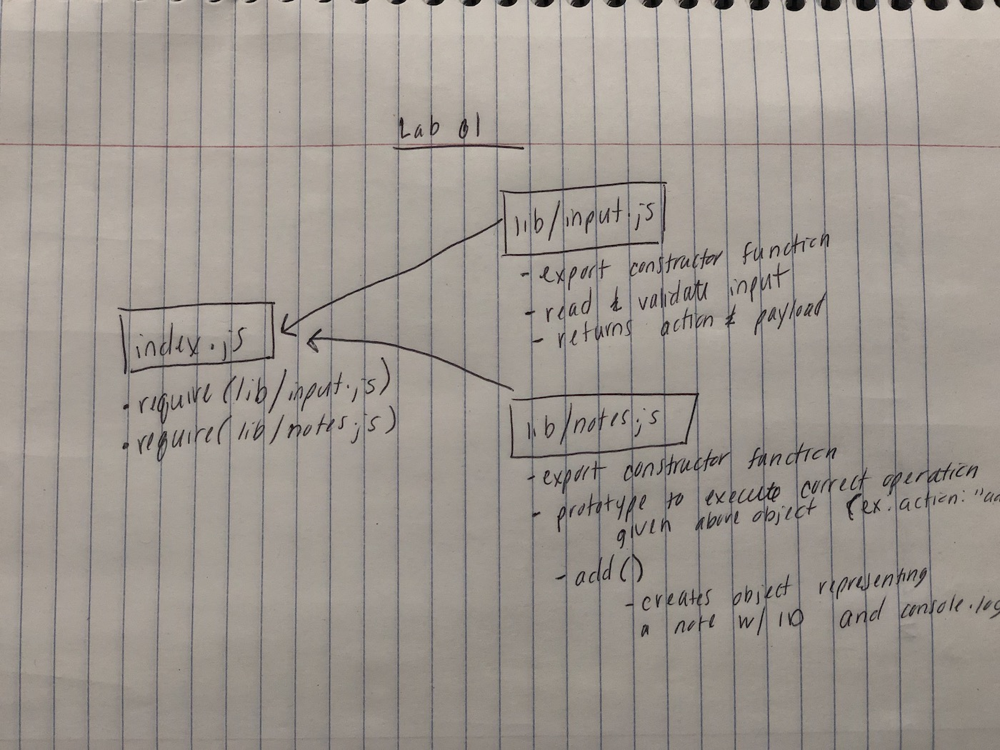
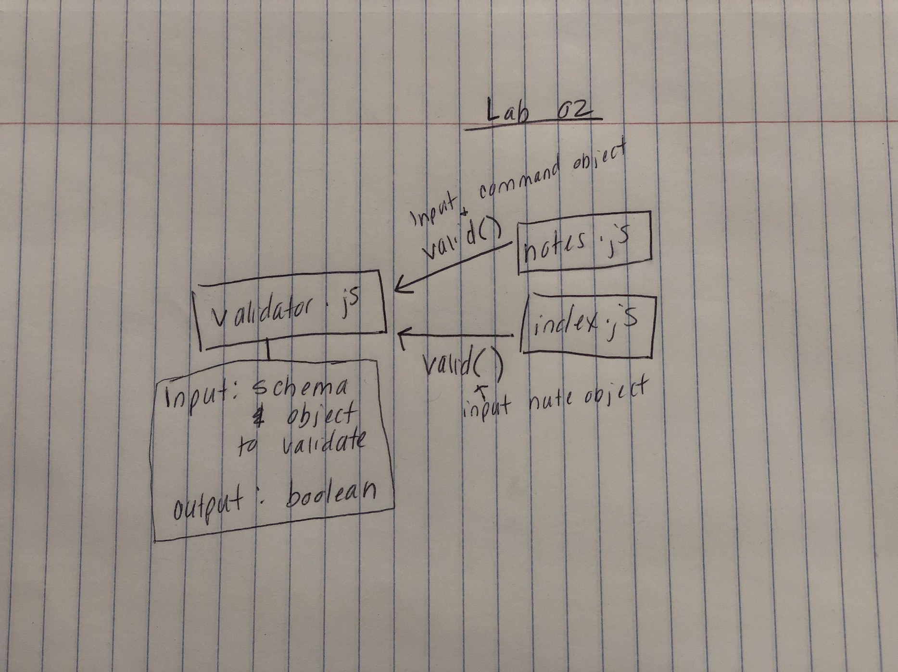

## Notesy Application

### Author: Susanna Lakey

#### Installation:
`npm install -g @slakey/notesy`

#### How to use the Notesy app
* From the command line, use the following commands:
  - Category: -c or --command
  - Add a new entry: notesy -a/--add "mango" -c "fruit"
  - Delete an entry: notesy -d/--delete "id-of-entry-here"
  - To list all entries: notesy -l/--list
  - To list an entry by category: notesy -l/--list "fruit"
  - To update and entry: notesy -u/--update "id of note to update" -t "text you want to replace with"

#### How to initialize/run your server app (where applicable)
* `npm install minimist mongoose mongo`

#### To run the server:
* `mongod --dbpath=db`

  
#### Tests
* Unit Tests: 'npm test'
* Lint Tests: 'npm run lint'

#### UML

### Links and Resources
* [submission PR](https://github.com/susannalakey-401-advanced-javascript/notes/pull/1)
* Help from Ben Lakey on how to organize tests when writing them.